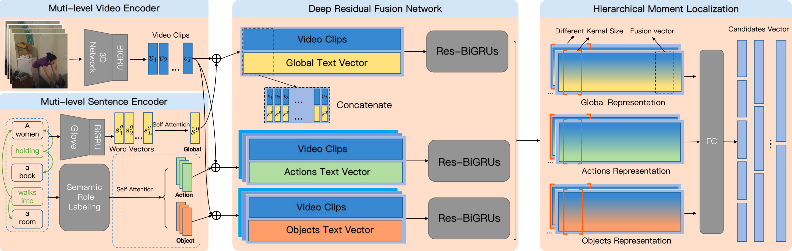

# Hierarchical Deep Residual Reasoning for Temporal Moment Localization
Official implementation for [***Hierarchical Deep Residual Reasoning for Temporal Moment Localization***](https://arxiv.org/abs/2111.00417)


## Model Pipeline




## Usage

### Environment Settings

We use the `PyTorch` framework.

* Python version: 3.6
* PyTorch version: 1.6

### Get Code

Clone the repository:

```shell
git clone https://github.com/ddlBoJack/HDRR.git
cd HDRR
```

### Data Preparation

#### Datasets

We preprocess the data in the same way as [MIGCN](https://github.com/zmzhang2000/MIGCN) do.

#### Semantic Role Labeling

Once you get the data above, you need to do semantic role labeling using `allennlp`: 

```shell
cd code
python semantic_role_labeling.py
```

### Training

Train HDRR on Charades-STA/ActivityNet with various features:

```shell
python main.py
```

### Testing

Test HDRR on Charades-STA/ActivityNet with various features:

```shell
python main.py --test --model_load_path
```

### Other Hyper-parameters

List other hyper-parameters by:

```shell
python main.py -h
```

## Reference

Please cite the following paper if HDRR is helpful for your research.

```
@article{ma2021hierarchical,
  title={Hierarchical Deep Residual Reasoning for Temporal Moment Localization},
  author={Ma, Ziyang and Han, Xianjing and Song, Xuemeng and Cui, Yiran and Nie, Liqiang},
  journal={arXiv preprint arXiv:2111.00417},
  year={2021}
}
```
